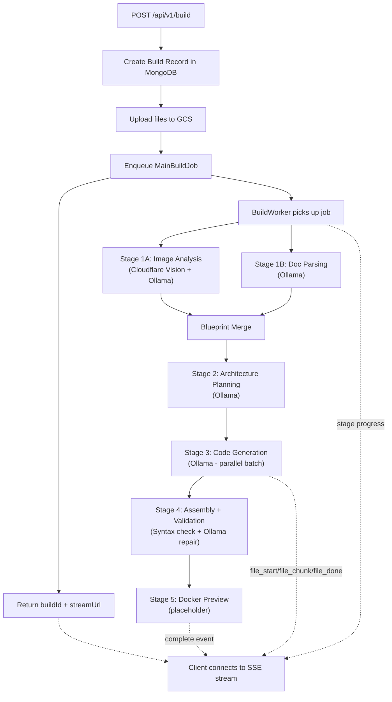

# Code Generation Pipeline — Stage 2 Complete (All Stages Built) ✅

> Built the entire end-to-end pipeline: **prompt → analysis → architecture → code generation → assembly → download**

---

## What Was Built

### Stage 1 — API + Build Model (7 files)

| File | Purpose |
|---|---|
| [redis.ts](file:///wsl.localhost/Ubuntu/home/projects/Devign-backend/src/config/redis.ts) | Shared Redis connection factory |
| [build.model.ts](file:///wsl.localhost/Ubuntu/home/projects/Devign-backend/src/models/build.model.ts) | Mongoose schema for `builds` collection |
| [buildUpload.ts](file:///wsl.localhost/Ubuntu/home/projects/Devign-backend/src/lib/buildUpload.ts) | Multer config (images + docs) |
| [buildQueue.ts](file:///wsl.localhost/Ubuntu/home/projects/Devign-backend/src/queues/buildQueue.ts) | 6 BullMQ queues |
| [buildController.ts](file:///wsl.localhost/Ubuntu/home/projects/Devign-backend/src/controllers/build/buildController.ts) | 4 API handlers incl. SSE streaming |
| [buildRoutes.ts](file:///wsl.localhost/Ubuntu/home/projects/Devign-backend/src/routes/build/buildRoutes.ts) | Route definitions |
| [app.ts](file:///wsl.localhost/Ubuntu/home/projects/Devign-backend/src/app.ts) | *(modified)* — mounted build routes |

---

### Stage 2 — Worker Infrastructure (3 files)

| File | Purpose |
|---|---|
| [publishEvent.ts](file:///wsl.localhost/Ubuntu/home/projects/Devign-backend/src/workers/utils/publishEvent.ts) | Typed SSE event publisher via Redis pub/sub |
| [stageRunner.ts](file:///wsl.localhost/Ubuntu/home/projects/Devign-backend/src/workers/stageRunner.ts) | Stage executor with MongoDB status tracking |
| [buildWorker.ts](file:///wsl.localhost/Ubuntu/home/projects/Devign-backend/src/workers/buildWorker.ts) | Main orchestrator — runs all 5 stages |

---

### Stage 3 — AI Pipeline (7 files)

| File | Purpose |
|---|---|
| [aiClient.ts](file:///wsl.localhost/Ubuntu/home/projects/Devign-backend/src/workers/utils/aiClient.ts) | **Ollama (primary)** + Cloudflare vision. Chat, stream, JSON modes |
| [promptBuilder.ts](file:///wsl.localhost/Ubuntu/home/projects/Devign-backend/src/workers/utils/promptBuilder.ts) | Context-rich prompts for each stage |
| [imageAnalysis.ts](file:///wsl.localhost/Ubuntu/home/projects/Devign-backend/src/workers/stages/imageAnalysis.ts) | Stage 1A — Cloudflare Vision → Ollama structured extraction |
| [docParsing.ts](file:///wsl.localhost/Ubuntu/home/projects/Devign-backend/src/workers/stages/docParsing.ts) | Stage 1B — Doc → Ollama feature/model extraction |
| [blueprintMerge.ts](file:///wsl.localhost/Ubuntu/home/projects/Devign-backend/src/workers/stages/blueprintMerge.ts) | Merges 1A + 1B into ProjectBlueprint |
| [architecturePlanning.ts](file:///wsl.localhost/Ubuntu/home/projects/Devign-backend/src/workers/stages/architecturePlanning.ts) | Stage 2 — Ollama plans file tree + routes + schema |
| [codeGenWorker.ts](file:///wsl.localhost/Ubuntu/home/projects/Devign-backend/src/workers/stages/codeGenWorker.ts) | Stage 3 — Parallel code gen with streaming to frontend |

---

### Stage 4 — Cost Tracking (1 file)

| File | Purpose |
|---|---|
| [costTracker.ts](file:///wsl.localhost/Ubuntu/home/projects/Devign-backend/src/workers/utils/costTracker.ts) | Atomic token usage tracking per API call |

---

### Stage 5 — Assembly + Preview (2 files)

| File | Purpose |
|---|---|
| [assemblyWorker.ts](file:///wsl.localhost/Ubuntu/home/projects/Devign-backend/src/workers/stages/assemblyWorker.ts) | Validation + repair loop + gzip archive |
| [dockerPreview.ts](file:///wsl.localhost/Ubuntu/home/projects/Devign-backend/src/workers/stages/dockerPreview.ts) | Docker preview placeholder |

---

## Architecture Diagram



## How to Run

```bash
# Start all processes (API server + image worker + build worker)
npm run dev

# Or start individually:
npm run dev:server         # API server (port 8000)
npm run dev:worker         # Image generation worker
npm run dev:build-worker   # Build pipeline worker
```

## TypeScript Status

✅ **Zero new errors** — all new worker/stage files compile clean. Only pre-existing `req.user` type errors remain.

## AI Provider Config

| Purpose | Provider | Model |
|---|---|---|
| Primary code gen | **Ollama** (hosted) | `qwen3-coder-next` |
| Image analysis | Cloudflare Workers AI | `@cf/unum/uform-gen2-qwen-500m` |
| Text enhancement | Cloudflare Workers AI | `@cf/meta/llama-3.1-8b-instruct` |
| Secondary | *TBD — ready to plug in* | — |

## File Tree (All New Files)

```
src/
├── config/
│   └── redis.ts
├── models/
│   └── build.model.ts
├── lib/
│   └── buildUpload.ts
├── routes/
│   └── build/
│       └── buildRoutes.ts
├── controllers/
│   └── build/
│       └── buildController.ts
├── queues/
│   └── buildQueue.ts
└── workers/
    ├── buildWorker.ts
    ├── stageRunner.ts
    ├── stages/
    │   ├── imageAnalysis.ts
    │   ├── docParsing.ts
    │   ├── blueprintMerge.ts
    │   ├── architecturePlanning.ts
    │   ├── codeGenWorker.ts
    │   ├── assemblyWorker.ts
    │   └── dockerPreview.ts
    └── utils/
        ├── publishEvent.ts
        ├── aiClient.ts
        ├── promptBuilder.ts
        └── costTracker.ts
```
